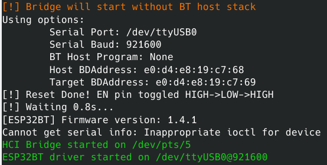

# *BrakTooth* ESP32 BR/EDR Active Sniffer/Injector

> Simple "Monitor mode" for Bluetooth Classic. Sniff or inject BR/EDR Baseband packets in ESP32 BT connections. 

This is a reverse engineered <u>**active**</u> BR/EDR sniffer and [ESP32 patching framework](https://github.com/Matheus-Garbelini/esp32_firmware_patching_framework), which can be used to explore the Bluetooth (BT) BR/EDR interaction between ESP32 controller and a remote target. 

Differently than <u>**passive**</u> sniffers, which do not interact with the BT network (piconet), the **<u>active</u>** sniffer connects itself to the remote BT device (BR/EDR target) and allows testing the BT protocol down to the Baseband layer while guided by a BT host stack such as **[blue-kitchen](https://github.com/bluekitchen/btstack)**. The *BrakTooth* sniffer supports cheap boards such as [ESP32-DOIT](https://www.aliexpress.com/item/1005001757645011.html?spm=a2g0o.productlist.0.0.364151a11nkQYT&algo_pvid=d71a7474-8721-44b8-ac22-2e7de1ebedcb&algo_exp_id=d71a7474-8721-44b8-ac22-2e7de1ebedcb-0&pdp_ext_f=%7B%22sku_id%22%3A%2212000017777037101%22%7D) ($4) or [ESP32-DevKitC](https://www.mouser.com/ProductDetail/Espressif-Systems/ESP32-DevKitC-32U?qs=%252BEew9%252B0nqrCEVvpkdH%2FG5Q%3D%3D) ($10).

<!-- START doctoc generated TOC please keep comment here to allow auto update -->
<!-- DON'T EDIT THIS SECTION, INSTEAD RE-RUN doctoc TO UPDATE -->
<h5>Table of Contents</h5>

- [Simplified Setup Overview](#simplified-setup-overview)
- [1) Installation](#1-installation)
    - [A. Install Linux requirements (Ubuntu 18.04 / 20.04)](#a-install-linux-requirements-ubuntu-1804--2004)
    - [B. Flash custom firmware to ESP32](#b-flash-custom-firmware-to-esp32)
- [2) Usage Instructions](#2-usage-instructions)
    - [Example 1 - Connect to remote target (Master Role)](#example-1---connect-to-remote-target-master-role)
    - [Example 2 - Wait for BT connection (Slave Role)](#example-2---wait-for-bt-connection-slave-role)
    - [Example 3 - HCI Bridge Mode (connect with other BT Host stack)](#example-3---hci-bridge-mode-connect-with-other-bt-host-stack)
- [3) Compile firmware from source (ESP32 Patching Framework)](#3-compile-firmware-from-source-esp32-patching-framework)
- [4) Customising BT Host programs (Profiles)](#4-customising-bt-host-programs-profiles)
- [Software Architecture of BrakTooth Sniffer](#software-architecture-of-braktooth-sniffer)
- [Features Overview](#features-overview)
- [Acknowledgements](#acknowledgements)

<!-- END doctoc generated TOC please keep comment here to allow auto update -->

### Simplified Setup Overview


### 1) Installation

##### A. Install Linux requirements (Ubuntu 18.04 / 20.04)

```bash
git clone https://github.com/Matheus-Garbelini/esp32_bluetooth_classic_sniffer
cd esp32_bluetooth_classic_sniffer
./requirements.sh # (sudo required) Installs latest wireshark and standalone python3 runtime
./build.sh 		  # Build BT Host programs and Wireshark h4bcm dissector
```

##### B. Flash custom firmware to ESP32

Before starting to use *BrakTooth* Sniffer, you need to upload a custom firmware to your ESP32 board:

```bash
./firmware.py flash /dev/ttyUSB0 # Change ttyUSB0 to match your port name
```

### 2) Usage Instructions

```bash
Usage: BTSnifferBREDR.py [OPTIONS]
Options:
  --port TEXT       Serial port name (/dev/ttyUSBx for Linux)
  --host TEXT       BDAddress of local host (default: E0:D4:E8:19:C7:68)
  --target TEXT     BDAddress of remote target (ex: a8:96:75:25:c2:ac)
  --live-wireshark  Opens Wireshark live session
  --live-terminal   Show a summary of each packet on terminal
  --bridge-only     Starts the HCI bridge without connecting any BT Host stack
  --help            Show this message and exit.
```

You can start the sniffer in as either master or slave role. If you use add `--target` argument, the sniffer will attempt a connection to your remote target. Otherwise, it will just wait for someone to connect to it.

Lastly, the `--bridge-only`  only creates the HCI pseudo terminal (/dev/pts/x) so ESP32 can operate as a standard HCI BT controller. You can use this feature to connect any other BT host stack to ESP32.

##### Example 1 - Connect to remote target (Master Role)

```bash
./BTSnifferBREDR.py --port=/dev/ttyUSB0 --target=E0:D4:E8:19:C7:69 --live-terminal --live-wireshark
```
<p align="center">

</p>

##### Example 2 - Wait for BT connection (Slave Role)

```bash
./BTSnifferBREDR.py --port=/dev/ttyUSB0 --live-terminal --live-wireshark
```

##### Example 3 - HCI Bridge Mode (connect with other BT Host stack)

```bash
./BTSnifferBREDR.py --port=/dev/ttyUSB0 --bridge-only --live-terminal --live-wireshark
```

<p align="center">

</p>


### 3) Compile firmware from source (ESP32 Patching Framework)

The source code can be built directly from the [ESP32 Firmware Patching Framework](https://github.com/Matheus-Garbelini/esp32_firmware_patching_framework) repository as follows:

```bash
cd firmware
./build_from_source.sh # clone submodule & build firmware with platformio environment 'sniffer-serial'
./firmware.py flash <serial port> # flash built firmware to ESP32 via serial port
```

The ESP32 firmware binaries (firmware.bin, bootloader.bin, partitions.bin) are copied to `firmware` folder upon successful build. Then, you can proceed to flash the firmware as described in [step 1.B)](https://github.com/Matheus-Garbelini/esp32_bluetooth_classic_sniffer#b-flash-custom-firmware-to-esp32).


### 4) Customising BT Host programs (Profiles)

Since *BrakTooth* sniffer uses a BT host stack to guide connectivity, the following modified BlueKitchen examples are used:

* **host_stack/sdp_rfcomm_query** - This program initiates connection with slave device and attempts to perform SDP scanning and pairing.
* **host_stack/spp_counter** - This program wait for connections and establish a spp (serial port) connection with the master device.

You can modify or add BT profiles to the current programs by following the official documentation of *[BlueKitchen](https://bluekitchen-gmbh.com/btstack/#examples/examples/index.html)*. Note that folder `host_stack/bluekitchen/example/` already contain some profile examples.


### Software Architecture of BrakTooth Sniffer

<p align="center">

</p>

The custom ESP32 BR/EDR Sniffer/Injector firmware communicates with the host system over a USB serial port and waits to receive custom commands or HCI commands. At startup, an HCI bridge is created to separate BrakTooth custom protocol from standard HCI commands sent or received from ESP32. Once the "RX/TX Sniffer" feature is enabled on the ESP32 firmware, Baseband packets are directly forwarded to *`BTSnifferBREDR.py`* script which simply decodes sniffed packets over the custom protocol and prints them via Scapy and/or dumps to Wireshark via live capture and to `logs` folder.


### Features Overview

<p align="center">

</p>

* **RX/TX Sniffer:** Dumps Baseband packets and forwards them to the host. Supported packets: 
  * Baseband Header
  * NULL/POLL from remote target
  * FHS (no scapy layer for now)
  * EIR (no dissection for now)
  * ACL Header
  * LMP
* **TX Interception:**
  This allows the host PC to modify TX packets in real-time before over-the-air transmission from
  ESP32. It requires however, an ESP32 board with high-speed USB such as [ESP-PROG](https://docs.espressif.com/projects/espressif-esp-iot-solution/en/latest/hw-reference/ESP-Prog_guide.html) or [ESP-WROVER-KIT](https://www.espressif.com/en/products/hardware/esp-wrover-kit/overview). Both of them have a [FTD2232H](https://ftdichip.com/products/ft2232hq/) USB to UART controller, which allows reduced USB pooling latency of *125us*. 
  **(disabled for now, sorry)**.
* **TX Injector:** This allows the host to inject BR/EDR packets immediately after the BT paging procedure and on every transmission slot (i.e. every 1.25ms) subjected to waits if there is something in ESP32 internal LMP queue.
  **(disabled for now, sorry)**.
* **RX/TX Bypass:** Effectively "*blinds*" ESP32 BT stack from receiving or transmitting LMP packets after the paging procedure. One can use this to construct a standalone LMP state machine on the host and with Scapy :slightly_smiling_face:.​ This feature could enable something similar to what has been done in [SweynTooth nRF52 dongle](https://github.com/Matheus-Garbelini/sweyntooth_bluetooth_low_energy_attacks), but for BR/EDR.
* **ROM Patcher:** Installs **ROM** hooks from inside the firmware.
* **HCI IN/OUT:** Standard communication interface with the BT Host stack. A third-party stack such as [bluekitchen](https://github.com/bluekitchen/btstack).


### Acknowledgements

The dissection of Baseband packets extends the [*InternalBlue* Broadcom Wireshark Dissector](https://github.com/seemoo-lab/h4bcm_wireshark_dissector). 
Specifically, the dissection extended the h4bcm Wireshark plugin to support a few more BT layers and our custom ESP32 metadata header. 
Thanks [@jiska2342](https://github.com/seemoo-lab/h4bcm_wireshark_dissector/commits?author=jiska2342).

Thanks to all the following open-source projects:

* Special thanks to [@Ebiroll](https://github.com/Ebiroll) for his maintenance on [Xtensa Module for Ghidra](https://github.com/Ebiroll/ghidra-xtensa)
* [@mringwal](https://github.com/mringwal) for the excellent open-source [BlueKitchen BT Host Stack](https://github.com/bluekitchen/btstack)
* [InternalBlue Project](https://github.com/seemoo-lab/internalblue)
* [Scapy Packet Manipulation Library](https://github.com/secdev/scapy)
* [Wireshark Project](https://gitlab.com/wireshark/wireshark)
